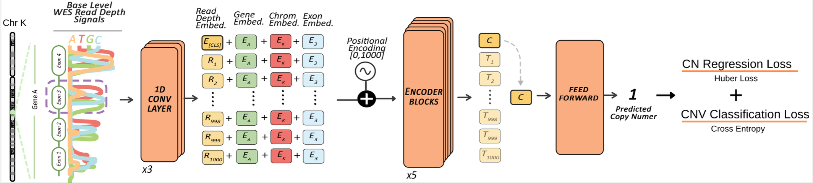
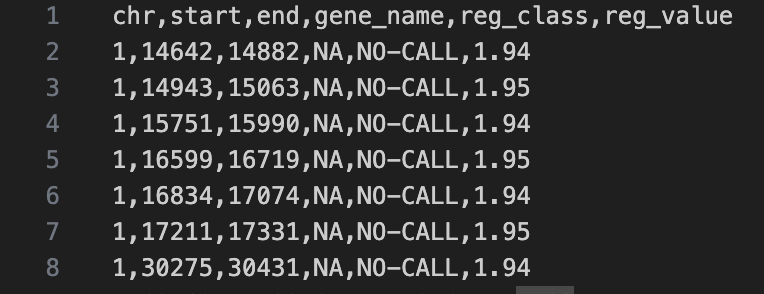
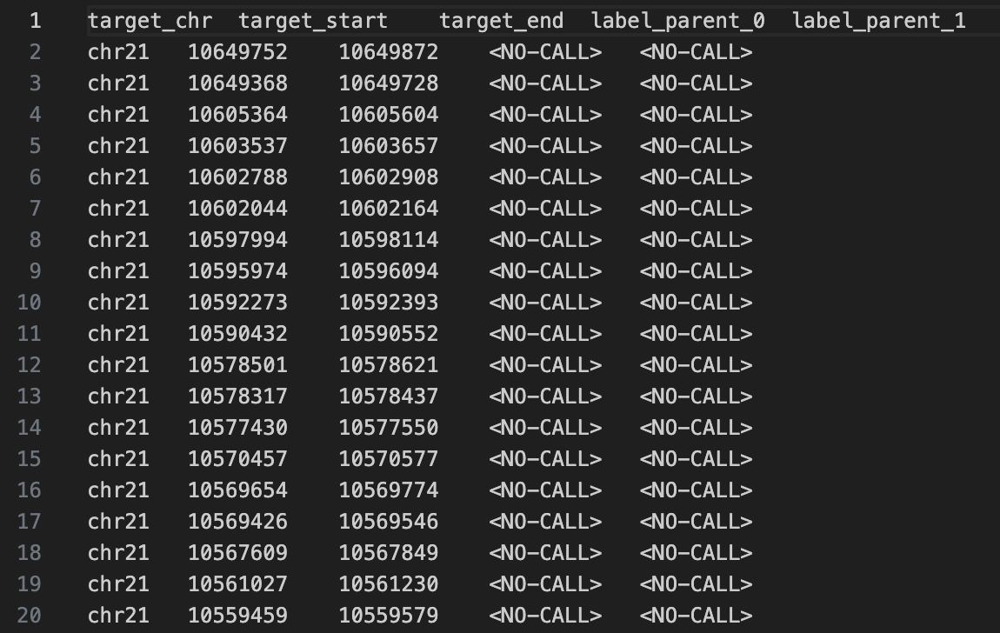
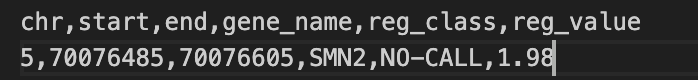

  

# ExactCN : Predicting Exact Copy Numbers on Whole Exome Sequencing Data

  

  

[](https://doi.org/10.5281/zenodo.17693515)

  

  

> ExactCN is a deep learning-based method for estimating **exact integer copy numbers** at the exon level from whole-exome sequencing (WES) data using read-depth signals.

> Beyond exome-wide prediction, the model is designed to be **fine-tuned** for specific targets. We provide **ExactCN-SMN**, a specialized version optimized for the SMN1/2 locus, to demonstrate how the framework can be adapted for other clinically relevant and challenging genes.

  

  

  

> The repository with processed samples, ground truth data, and CN estimations for real and simulated datasets to reproduce the analyses in the paper can be found here: <a  href="https://doi.org/10.5281/zenodo.17693515)"  target="_blank">**ExactCN results reproduction**</a>

  

  

>  <a  href="https://en.wikipedia.org/wiki/Deep_learning"  target="_blank">**Deep Learning**</a>, <a  href="https://en.wikipedia.org/wiki/Copy-number_variation"  target="_blank">**Copy Number Variation**</a>, <a  href="https://en.wikipedia.org/wiki/Exome_sequencing"  target="_blank">**Whole Exome Sequencing**</a>

  

  
  



  

  

---

  

  

## Authors

  

  

Erfan FarhangKia†, Ahmet Arda Ceylan†, Mert Gençtürk, Mehmet Alper Yılmaz, Furkan Karademir, and A. Ercüment Cicek

  

† Equal contribution

  

---

  

  

## Questions & comments

  

  

[firstauthorname].[firstauthorsurname]@bilkent.edu.tr

  

  

[lastauthorsurname]@cs.bilkent.edu.tr

  

  

---

  

  

## Table of Contents

  

  

> Warning: Please note that ExactCN software is completely free for academic usage. However it is licenced for commercial usage. Please first refer to the [License](#license) section for more info.

  

  

- [Installation](#installation)

  

- [Features](#features)

  

- [Instructions Manual](#instructions-manual)

  

- [Usage Examples](#usage-examples)

  

- [Citations](#citations)

  

- [License](#license)

  

  

---

  

  

## Installation

  

  

- ExactCN is a python3 script and it is easy to run after the required packages are installed.

  

  

### Requirements

  

  

For easy requirement handling, you can use exactcn_environment.yml files to initialize conda environment with requirements installed:

  

  

```shell

  

$  conda  env  create  --name  exactcn_env  -f  exactcn_environment.yml

  

$  conda  activate  exactcn_env

  

```

  

  

Note that the provided environment yml file is for Linux systems. For MacOS users, the corresponding versions of the packages might need to be changed.

  

---

  

  

## Features

  

  

- ExactCN provides GPU support optionally. See [GPU Support](#gpu-support) section.

  

  

## Instructions Manual for ExactCN

  

Important notice: Please call the call_exactcn.py script from the scripts directory.

  

  

### Required Arguments

  

  

#### -m, --model

  

- Relative or direct path to the trained model checkpoint.

  

  

#### -bs, --batch_size

  

- Batch size to be used to perform CN estimation on the samples.

  

  

#### -i, --input

  

- Relative or direct path for the processed HDF5 file(s) containing WES data.

  

  

#### -o, --output

  

- Relative or direct output directory path to write ExactCN output file.

  

  
  

  

#### -s, --stats_lookup

  

- Relative or direct path to the normalization CSV file containing signal mean and standard deviation statistics per nucleotide channel. These statistics are utilized to normalize the input signals before inference.

  

  

### Optional Arguments

  

  

#### -j, --jobs

  

-Number of parallel worker processes to spawn for processing samples. Use this to speed up inference across multiple samples (Default: 2).

  

#### -v, --vocab

- Relative or direct path to the `gene_vocab.txt` file. Providing the specific vocabulary file used during training ensures that gene IDs are mapped consistently. If omitted, the script attempts to build it from the input file.

  

#### -g, --gpu

  

- Set to PCI BUS ID of the gpu in your system.

  

- You can check, PCI BUS IDs of the gpus in your system with various ways. Using gpustat tool check IDs of the gpus in your system like below:

  

  

#### -v, --version

  

-Check the version of ExactCN.

  

  

#### -h, --help

  

-See help page.

  

  

## Usage Example

  

  

> ExactCN is very easy to use! Here, We provide an example small-sized BAM file and show how to run ExactCN on this toy dataset.

  

  

### Step-0: Install conda package management

  

  

- This project uses conda package management software to create virtual environment and facilitate reproducability.

  

  

- For Linux users:

  

- Please take a look at the <a  href="https://repo.anaconda.com/archive/"  target="_blank">**Anaconda repo archive page**</a>, and select an appropriate version that you'd like to install.

  

- Replace this `Anaconda3-version.num-Linux-x86_64.sh` with your choice

  

  

```shell

  

$  wget  -c  https://repo.continuum.io/archive/Anaconda3-vers.num-Linux-x86_64.sh

  

$  bash  Anaconda3-version.num-Linux-x86_64.sh

  

```

  

  

### Step-1: Set Up your environment.

  

  

- It is important to set up the conda environment which includes the necessary dependencies.

  

- Please run the following lines to create and activate the environment:

  

  

```shell

  

$  conda  env  create  --name  exactcn_env  -f  exactcn_environment.yml

  

$  conda  activate  exactcn_env

  

```

  

  

### Step-2: Run the preprocessing script.

  

  

- It is necessary to perform preprocessing on WES data samples to obtain read depth and other meta data and make them ready for CN estimation.

  

- Please run the following line:

  

  

```shell

  

$  source  preprocess_samples_inference.sh

  

```

  

  

### Step-3: Run ExactCN on data obtained in Step-2

  

  

- Here, we demonstrate an example to run ExactCN on gpu device 0, and obtain exone-level CN prediction.

  

- Please run the following script:

  

  

```shell

  

$  source  call_exactcn.sh

  

```

  
  
  

### Output file of ExactCN

  

- At the end of the CN estimation procedure, ExactCN will write its output file to the directory given with -o option. In this tutorial it is ./exactcn_results

  

- Output file of ExactCN is a tab-delimited.

  
  

- Columns in the gene-level output file of ExactCN are the following with order: 1. Chromosome, 2. Start Position, 3. End Position, 4. Gene Name 5. CNV Calling Result 6. CN Estimation

  

- Following figure is an example of ExactCN exone-level output file.

  

  



  

  

## Instructions Manual for Finetuning ExactCN

  

Important notice: Please call the finetune_exactcn.py script from the scripts directory.

  

### Required Arguments

  

  

#### -bs, --batch_size

  

- Batch size to be used to perform CN estimation on the WES samples.

  

  

#### -i, --input

  

- Relative or direct path for the input HDF5 dataset.

  

  

#### -o, --output

  

- Relative or direct output directory path to write ExactCN output weights.

  

  

#### -n, --norm_file

  

- Relative or direct path to the lookup file containing mean and standard deviation statistics of signal values. These statistics are utilized to normalize the input data during training.

  

  

#### -e, --epochs

  

- The number of epochs the finetuning will be performed.

  

  

#### -lr, --learning_rate

  

- The learning rate to be used in finetuning

  

  

#### --pretrained_dir

  

- The path for the pretrained model weights to be loaded for finetuning

  

  

### Optional Arguments

  
  

#### -g, --gpu

  

- Set to PCI BUS ID of the gpu in your system.

  

- You can check, PCI BUS IDs of the gpus in your system with various ways. Using gpustat tool check IDs of the gpus in your system like below:

  

  

#### -v, --version

  

-Check the version of ExactCN.

  

  

#### -h, --help

  

-See help page.

  

  

## Finetune Example

  

  

> You may want to fine-tune ExactCN with your WES dataset. We provide an example of how ExactCN can be fine-tuned using a small-sized BAM file along with its corresponding ground truth calls.

  

  

> Step-0 and Step-1 are the same as the ExactCN call example.

  

  

### Step-0: Install conda package management

  

  

- This project uses conda package management software to create virtual environment and facilitate reproducability.

  

  

- For Linux users:

  

- Please take a look at the <a  href="https://repo.anaconda.com/archive/"  target="_blank">**Anaconda repo archive page**</a>, and select an appropriate version that you'd like to install.

  

- Replace this `Anaconda3-version.num-Linux-x86_64.sh` with your choice

  

  

```shell

  

$  wget  -c  https://repo.continuum.io/archive/Anaconda3-vers.num-Linux-x86_64.sh

  

$  bash  Anaconda3-version.num-Linux-x86_64.sh

  

```

  

  

### Step-1: Set Up your environment.

  

  

- It is important to set up the conda environment which includes the necessary dependencies.

  

- Please run the following lines to create and activate the environment:

  

  

```shell

  

$  conda  env  create  --name  exactcn_env  -f  exactcn_environment.yml

  

$  conda  activate  exactcn_env

  

```

  

  

### Step-2: Run the preprocessing script for preparing the samples for finetuning.

  

  

- It is necessary to perform preprocessing on WES data samples to obtain read depth and other meta data and make them ready for ExactCN finetuning.

  

- ExactCN Finetuning requires .bam and ground truth calls. Please see the below image for a sample ground truths format.

  

  



  

- Please run the following line:

  

  

```shell

  

$  source  preprocess_samples_finetuning.sh

  

```

  

  

### Step-3: Start ExactCN Finetuning on data obtained in Step-2

  

  

- Here, we demonstrate an example to run ExactCN Finetuning on gpu device 0.

  

- Please run the following script:

  

  

```shell

  

$  source  exactcn_finetune.sh

  

```

  

You can change the argument parameters within the script to run it on cpu.

  

  

### Output file of ExactCN

  

- At the end of ExactCN Finetuning, the script will save its model weights file to the directory given with -o option. In this tutorial it is ./exactcn_finetuned_model_weights

  

## Instructions Manual for ExactCN-SMN

  
ExactCN-SMN is a specialised fine tuned model for aggregated SMN region CNV calling on Exon 7. 


Important notice: Please call the call_exactcn_smn.py script from the scripts directory.

  

  

### Required Arguments

  

  

#### -m, --model

  

- Relative or direct path to the trained model checkpoint.

  

  

#### -bs, --batch_size

  

- Batch size to be used to perform CN estimation on the samples.

  

  

#### -i, --input

  

- Relative or direct path for the processed HDF5 file(s) containing WES data.

  

  

#### -o, --output

  

- Relative or direct output directory path to write ExactCN-SMN output file.

  

  
  

  

#### -s, --stats_lookup

  

- Relative or direct path to the normalization CSV file containing signal mean and standard deviation statistics per nucleotide channel. These statistics are utilized to normalize the input signals before inference.

  

  

### Optional Arguments

  

  

#### -j, --jobs

  

-Number of parallel worker processes to spawn for processing samples. Use this to speed up inference across multiple samples (Default: 2).

  

#### -v, --vocab

- Relative or direct path to the `gene_vocab.txt` file. _Highly Recommended:_ Providing the specific vocabulary file used during training ensures that gene IDs are mapped consistently. If omitted, the script attempts to build it from the input file.

  

#### -g, --gpu

  

- Set to PCI BUS ID of the gpu in your system.

  

- You can check, PCI BUS IDs of the gpus in your system with various ways. Using gpustat tool check IDs of the gpus in your system like below:

  

  

#### -v, --version

  

-Check the version of ExactCN.

  

  

#### -h, --help

  

-See help page.

  

  

## Usage Example

  

  

> We provide an example small-sized BAM file and show how to run ExactCN-SMN on this toy dataset.

  
  
  
  

  

### Step-0: Install conda package management

  

  

- This project uses conda package management software to create virtual environment and facilitate reproducability.

  

  

- For Linux users:

  

- Please take a look at the <a  href="https://repo.anaconda.com/archive/"  target="_blank">**Anaconda repo archive page**</a>, and select an appropriate version that you'd like to install.

  

- Replace this `Anaconda3-version.num-Linux-x86_64.sh` with your choice

  

  

```shell

  

$  wget  -c  https://repo.continuum.io/archive/Anaconda3-vers.num-Linux-x86_64.sh

  

$  bash  Anaconda3-version.num-Linux-x86_64.sh

  

```

  

  

### Step-1: Set Up your environment.

  

  

- It is important to set up the conda environment which includes the necessary dependencies.

  

- Please run the following lines to create and activate the environment:

  

  

```shell

  

$  conda  env  create  --name  exactcn_env  -f  exactcn_environment.yml

  

$  conda  activate  exactcn_env

  

```

  

  

### Step-2: Run the preprocessing script.

  

  

- It is necessary to perform preprocessing on WES data samples to obtain read depth and other meta data and make them ready for CN estimation.

  

- Please run the following line:

  

  

```shell

  

$  source  preprocess_samples_smn.sh

  

```

  

  

### Step-3: Run ExactCN-SMN on data obtained in Step-2

  

  

- Here, we demonstrate an example to run ExactCN-SMN on gpu device 0, and obtain exone-level CN prediction on SMN region.

  

- Please run the following script:

  

  

```shell

  

$  source  call_exactcn_smn.sh

  

```

  
  
  

### Output file of ExactCN-SMN

  

- At the end of the CN estimation procedure, ExactCN-SMN will write its output file to the directory given with -o option. In this tutorial it is ./exactcn_smn_results

  

  
  

- Columns in the gene-level output file of ExactCN-SMN are the following with order: 1. Chromosome, 2. Start Position, 3. End Position, 4. Gene Name 5. CNV Calling Result 6. CN Estimation

  

- Following figure is an example of ExactCN-SMN exone-level output file:

  

  



  

---

  

  

## Citations

  

  

---

  

  

## License

  

  

-  **[CC BY-NC-SA 2.0](https://creativecommons.org/licenses/by-nc-sa/2.0/)**

  

- Copyright 2024 © ExactCN.

  

- For commercial usage, please contact.